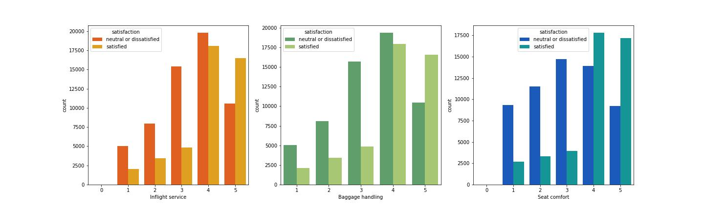

# EDA-Airline-Passenger-Satisfaction

[Sumber](https://d2poqm5pskresc.cloudfront.net/wp-content/uploads/2019/10/airlines.jpg)
###### by Hanifah Nurfahmi

# **LATAR BELAKANG**
Setelah COVID-19 mereda, orang-orang kembali melakukan perjalanan baik jauh maupun dekat. Melakukan perjalanan dengan tujuan bisnis ataupun pribadi seperti bertemu keluarga yang sudah tidak ditemui selama dua tahun. Berbagai transportasi umum mulai membuka kembali jalur perjalanannya, salah satunya Pesawat Terbang. Maskapai penerbangan mulai berbondong-bondong untuk membuka kembali berbagai rute penerbangan untuk menarik penumpang. Salah satu maskapai yang tidak disebutkan namanya melakukan survei sebelumnya tentang tingkat kepuasan terhadap penumpang maskapai penerbangan tersebut, yang nantinya data survei tersebut di unggah pada laman [Kaggle](https://www.kaggle.com/datasets/teejmahal20/airline-passenger-satisfaction).

# **PERNYATAAN MASALAH**
Maskapai ingin mengetahui faktor yang mempengaruhi kepuasan pelanggan.
Untuk mengetahuinya ada 6 *Business Question* yang dapat mengetahui faktor yang mempengaruhi kepuasan pelanggan.

# **DATA ANALYSIS**

#### **Business Question 1** 
Apa saja 3 skala survei penumpang merasa puas dan tidak puas? 

#### Insight :
- Berdasarkan analisis 14 skala survei terdapat top 3 yang membuat penumpang **puas** berdasarkan mean(rata-rata) dan 50%(median) yaitu `Inflight service`, `Baggage handling` dan `Seat comfort`. Ketiga skala tersebut memiliki mean diatas 3,4 dan memiliki median 4. 
- Berdasarkan analisis 14 skala survei terdapat bottom 3 yang membuat penumpang **netral atau tidak puas** berdasarkan mean(rata-rata) dan 50%(median) yaitu `Inflight wifi service`, `Ease of Online booking` dan `Gate location`. Ketiga skala tersebut memiliki mean dibawah 3 dan memiliki median 3. 
- Dapat dilihat melalui `countplot` di atas, untuk top 3 *satisfied* banyak yang memberikan skor 4 dan 5. Namun, sebaliknya untuk bottom 3 *neutral or dissatisfied* lebih banyak pemberi skor 3, 2 serta 1.

#### **Business Question 2** 
Kelas penumpang mana yang banyak tidak puas dengan pelayanan maskapai penerbangan? 

#### Insight :
Berdasarkan analisis di atas, Kelas Ekonomi merasa netral atau tidak puas dengan pelayanan diberikan maskapai penerbangan yaitu sebesar 81% diikuti dengan kelas Ekonomi Plus sebesar 75%. Ini cukup membuktikan bahwa terdapat kesenjangan pelayanan antara Kelas Bisnis dengan Kelas Ekonomi & Ekonomi sangat besar.

#### **Business Question 3** 
Bagaimana hubungan tujuan perjalanan dengan kepuasan penumpang?

#### Insight :
- Dari analisa di atas penumpang dengan tujuan bisnis lebih banyak yang merasa puas dengan pelayanan maskapai. Itu di karenakan sebanyak 66% penumpang yang bertujuan bisnis menggunakan kelas bisnis untuk penerbangannya. Dengan fasilitas yang nyaman pada saat perjalanan bisnis membuat penumpang merasa puas.
- Sebaliknya penumpang dengan tujuan pribadi lebih memilih banyak yang merasa tidak puas. Itu dikarenakan sebanyak 82% menggunakan Kelas Ekonomi lalu 11% menggunakan Kelas Ekonomi Plus sedangkan sisanya menggunakan Kelas Bisnis. Penumpang dengan tujuan pribadi menggunakan kelas Ekonomi karena harganya lebih terjangkau
Sumber: https://www.corptraveller.com/en-ca/resources/insights/guide-business-travel-economy-classes-explained

#### **Business Question 4** 
Bagaimana hubungan tipe penumpang dengan tingkat kepuasan penumpang?

#### Insight :
Berdasarkan analisis di atas penumpang yang netral atau tidak puas pada penerbangan pertamanya menggunakan maskapai ini sebesar 76% , sedangkan penumpang yang sudah lebih dari sekali menggunakan maskapai ini tingkat ketidakpuasannya sebesar 52%. Ini sangat tidak bagus.

#### **Business Question 5** 
Bagaimana hubungan umur dengan tingkat kepuasan penumpang?

#### Insight :
Berdasarkan analisis kategori *Adult* paling banyak menggunakan jasa penerbangan dibandingkan kategori umur lain. Tingkat ketidakpuasan paling besar ada pada kategori *Children* sebesar 86% disusul oleh kategori usia *Senior* sebesar 82%. Sementara tingkat kepuasan paling besar ada pada kategori usia *Adult* sebesar 49% dan kategori *Youth* sebesar 32%.

#### **Business Question 6** 
Bagaimana hubungan keterlambatan pesawat terhadap kepuasan penumpang?

#### Insight :
- Berdasarkan analisis di atas waktu Keterlambatan pesawat saat kedatangan maupun keberangkatan tidak memiliki hubungan dengan tingkat kepuasan pelanggan.
- Pada `scatterplot` di atas terdapat penumpang yang mengalami keterlambatan lebih dari 800 menit namun penumpang tersebut merasa puas dengan pelayanan maskapai ini. Sebaliknya penumpang dengan keterlambatan di bawah 200 menit merasa netral atau tidak puas.
- Pada `countplot` di atas perbedaan nya tidak terlalu signifikan antara penumpang pesawat yang merasa puas dan netral atau tidak puas. Perbedaan yang cukup besar hanya terdapat pada skor 4.
